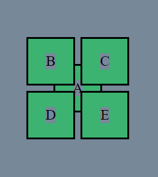

# 08.  30 Sept'23 Positions in CSS Assignment 

---

## Task 1
### - Code
#### - HTML
```html
<!doctype html>
<html lang="en">
<head>
    <meta charset="UTF-8">
    <meta content="width=device-width, user-scalable=no, initial-scale=1.0, maximum-scale=1.0, minimum-scale=1.0"
          name="viewport">
    <meta content="ie=edge" http-equiv="X-UA-Compatible">
    <title>HW_08 || Q1 </title>
    <link rel="stylesheet" href="style.css">
</head>
<body>
<div class="container">
    <div class="boxA box">
        <p>A</p>
    </div>
    <div class="boxB box">
        <p>B</p>
    </div>
    <div class="boxC box">
        <p>C</p>
    </div>
    <div class="boxD box">
        <p>D</p>
    </div>
    <div class="boxE box">
        <p>E</p>
    </div>
</div>
</body>
</html>
```
#### CSS
```css
* {
    background-color: lightslategray;
}

.box {
    height: 50px;
    width: 50px;
    display: flex;
    justify-content: center;
    align-items: center;
    border: 2px solid black;
    background-color: mediumseagreen;
    position: absolute;
}

.container {
    width: 110px;
    height: 110px;
    position: relative;
    left: 200px;
    top: 200px;
}
.boxA {
    left: 30px;
    top: 30px;
}

.boxC {
    left: 60px;
}

.boxD {
    top: 60px;
}

.boxE {
    left: 60px;
    top: 60px;
}
```
### Result Image


---
---

## Task 2
### Response
---

## Task 2
### - Code
#### - HTML
#### - CSS
### - Image