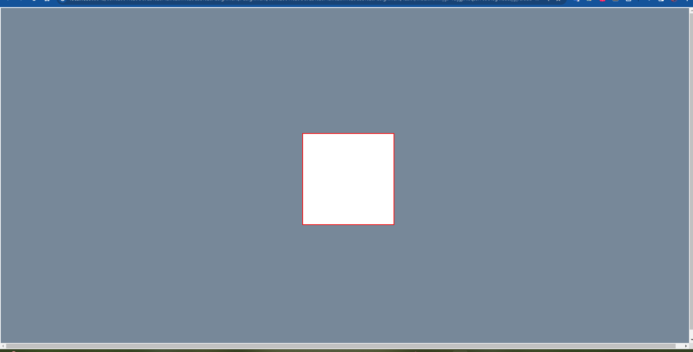

# Flexbox in CSS

---

## Q1
### Response

#### CSS Flexbox:

1. **One-Dimensional Layout:**
    - Flexbox is designed for one-dimensional layouts, either as a row or a column.

2. **Flexibility in Size:**
    - It provides flexibility in distributing space along a single axis, allowing items to grow or shrink as needed.

3. **Content Order:**
    - Flexbox allows you to control the order of the elements, regardless of their source order in the HTML.

4. **Alignment:**
    - It excels at aligning items along the main axis and cross axis, providing powerful alignment options.

5. **Responsive Design:**
    - Flexbox is well-suited for building responsive designs, especially when dealing with dynamic content or unknown sizes of items.

#### When to use Flexbox:
- Use Flexbox when dealing with one-dimensional layouts, such as navigation bars, sidebars, or lists where items need to be aligned along a single axis.

#### CSS Grid:

1. **Two-Dimensional Layout:**
    - Grid is designed for two-dimensional layouts, providing both rows and columns.

2. **Precise Item Placement:**
    - It allows for precise control over the placement of items within the grid, specifying rows and columns explicitly.

3. **Grid Lines and Cells:**
    - You can define explicit grid lines and place items into specific cells, making it great for complex layouts.

4. **Responsive Design:**
    - Grid is powerful for creating responsive layouts, especially when dealing with complex designs that require control over both rows and columns.

5. **Alignment:**
    - While Grid provides some alignment properties, its primary strength is in creating complex, structured layouts.

#### When to use Grid:
- Use Grid when you need a two-dimensional layout, such as for overall page layout, complex forms, or any design where precise control over both rows and columns is essential.

#### When to use Both:
- Often, a combination of Flexbox and Grid is used in the same project. Flexbox can handle the alignment of items within a container, while Grid can be used for the overall page layout or section-specific layouts. They complement each other and are not mutually exclusive.

In summary, choose Flexbox for one-dimensional layouts and Grid for two-dimensional layouts, and consider using both together to take advantage of their strengths in different aspects of your design.

---

### Q2
### Flexbox Layout Properties

#### 1. justify-content:
- **Role:** This property defines how the browser distributes space along the main axis (horizontal axis in a row, vertical axis in a column) of a flex container.
- **Values:**
    - `flex-start`: Items are packed toward the start of the main axis.
    - `flex-end`: Items are packed toward the end of the main axis.
    - `center`: Items are centered along the main axis.
    - `space-between`: Items are evenly distributed along the main axis, with the first item at the start and the last item at the end.
    - `space-around`: Items are evenly distributed along the main axis with equal space around them.
    - `space-evenly`: Items are evenly distributed along the main axis with equal space around them, including space before the first and after the last item.

#### 2. align-items:
- **Role:** This property defines how the browser aligns items along the cross axis (vertical axis in a row, horizontal axis in a column) of a flex container.
- **Values:**
    - `flex-start`: Items are aligned at the start of the cross axis.
    - `flex-end`: Items are aligned at the end of the cross axis.
    - `center`: Items are centered along the cross axis.
    - `baseline`: Items are aligned based on their baseline.
    - `stretch`: Items are stretched to fill the container along the cross axis.

#### 3. gap:
- **Role:** This property sets the gap between flex items within a flex container. It is a shorthand property for `row-gap` and `column-gap`.
- **Values:**
    - It accepts length values like pixels or percentages.
    - It can also be set to `normal`, which is equivalent to using the browser's default spacing.

#### 4. flex-direction:
- **Role:** This property defines the direction of the main axis in a flex container, determining how flex items are placed in the flex container.
- **Values:**
    - `row`: Main axis is in the inline direction (left to right in most cases).
    - `row-reverse`: Main axis is in the inline direction, but reversed.
    - `column`: Main axis is in the block direction (top to bottom in most cases).
    - `column-reverse`: Main axis is in the block direction, but reversed.

#### 5. flex-wrap:
- **Role:** This property defines whether flex items should wrap onto multiple lines or stay on a single line within a flex container.
- **Values:**
    - `nowrap`: All flex items are forced onto one line.
    - `wrap`: Flex items can wrap onto multiple lines if needed.
    - `wrap-reverse`: Flex items wrap onto multiple lines in the reverse order.

These properties collectively allow developers to create flexible and responsive layouts by controlling the arrangement, alignment, and spacing of items within a flex container. They are crucial for building adaptive and dynamic user interfaces.

---

### Q3
### - Response
#### - Html
```html
<!doctype html>
<html lang="en">
<head>
    <meta charset="UTF-8">
    <meta name="viewport"
          content="width=device-width, user-scalable=no, initial-scale=1.0, maximum-scale=1.0, minimum-scale=1.0">
    <meta http-equiv="X-UA-Compatible" content="ie=edge">
    <title>Assignment 09 || Q3</title>
    <link rel="stylesheet" href="Style.css">
</head>
<body>
<div class="parent">
    <div class="child">

    </div>
</div>
</body>
</html>
```
#### - CSS
```css
body {
    background-color: lightslategray;
    margin: 0;
    padding: 0;
}

.parent {
    border: 2px solid white;
    height: 100vh;
    width: 100vw;
    display: flex;
    align-items: center;
    justify-content: center;
}

.child {
    border: 2px solid red;
    background-color: white;
    height: 200px;
    width: 200px
}
```
#### - Image
