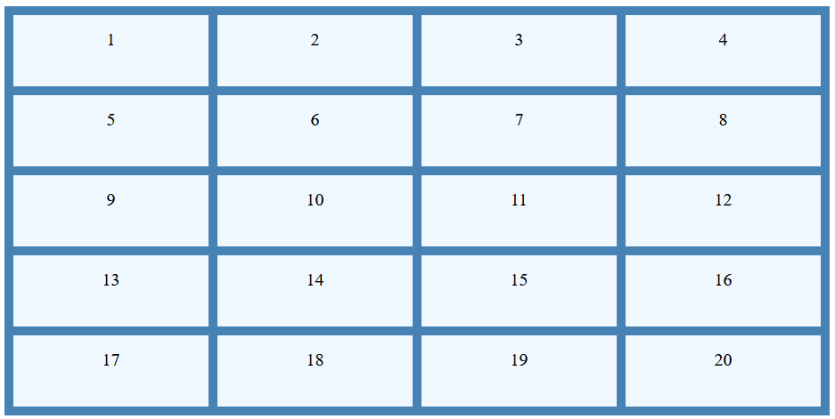
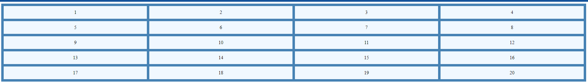

# Explain the use of grid-auto-row and grid-auto-column using code examples.

### In CSS Grid Layout, the grid-auto-row and grid-auto-column properties are used to define the size of rows and columns that are implicitly created by the grid when you have more items than explicitly defined rows or columns.

### **Grid-auto-row**
Imagine your grid layout as a table. `grid-auto-rows` is like the default row height for any extra rows you need. Here's how it works:

- You set some rows with exact heights or patterns using `grid-template-rows`.
- If you add more items than those rows can hold, the grid automatically creates new rows.
- `grid-auto-rows` tells the grid how tall those new rows should be. You can set it:
    - To a specific size like `50px`.
    - To adapt to its content (`auto`).
    - To share space equally with other rows (`fr`).

So, it's like saying, "For any extra rows I add, make them this height." This gives you a flexible layout that can adjust to different content without you needing to define every single row.
 
```html
<!doctype html>
<html lang="en">
<head>
  <meta charset="UTF-8">
  <meta content="width=device-width, user-scalable=no, initial-scale=1.0, maximum-scale=1.0, minimum-scale=1.0"
        name="viewport">
  <meta content="ie=edge" http-equiv="X-UA-Compatible">
  <title>Lecture 10 || Q3 || Example 1</title>
  <style>
    .grid-container {
      background-color: steelblue;
      padding: 10px;
      display: grid;
      grid-gap: 10px;
      grid-template-columns: repeat(4, 1fr);
      grid-auto-rows: 80px;
    }

    .grid-container div {
      background-color: aliceblue;
      padding: 15px;
      text-align: center;
      font-size: 20px;
    }
  </style>
</head>
<body>
<div class="grid-container">
  <div>1</div>
  <div>2</div>
  <div>3</div>
  <div>4</div>
  <div>5</div>
  <div>6</div>
  <div>7</div>
  <div>8</div>
  <div>9</div>
  <div>10</div>
  <div>11</div>
  <div>12</div>
  <div>13</div>
  <div>14</div>
  <div>15</div>
  <div>16</div>
  <div>17</div>
  <div>18</div>
  <div>19</div>
  <div>20</div>
</div>
</body>
</html>
```


### **Grid-auto-column**
It is the same function as the Grid-auto-row as we have seen above it just work on the column side.
```html
<!doctype html>
<html lang="en">
<head>
    <meta charset="UTF-8">
    <meta content="width=device-width, user-scalable=no, initial-scale=1.0, maximum-scale=1.0, minimum-scale=1.0"
          name="viewport">
    <meta content="ie=edge" http-equiv="X-UA-Compatible">
    <title>Lecture 10 || Q3 || Example 2</title>
    <style>
        .grid-container {
            background-color: steelblue;
            padding: 10px;
            display: grid;
            grid-gap: 10px;
            grid-template-rows: repeat(4, 1fr);
            grid-template-columns: repeat(4, 1fr);
            grid-auto-columns: 100px;
        }

        .grid-container div {
            background-color: aliceblue;
            padding: 15px;
            text-align: center;
            font-size: 20px;
        }
    </style>
</head>
<body>
<div class="grid-container">
    <div>1</div>
    <div>2</div>
    <div>3</div>
    <div>4</div>
    <div>5</div>
    <div>6</div>
    <div>7</div>
    <div>8</div>
    <div>9</div>
    <div>10</div>
    <div>11</div>
    <div>12</div>
    <div>13</div>
    <div>14</div>
    <div>15</div>
    <div>16</div>
    <div>17</div>
    <div>18</div>
    <div>19</div>
    <div>20</div>
</div>
</body>
</html>
```

