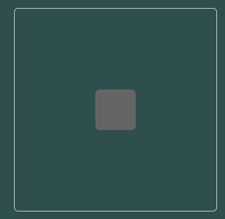
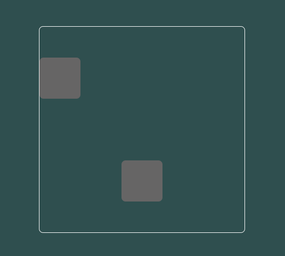

# Explain the difference between `justify-items` and `justify-self` using code examples.
## `justify-items:`
### The `justify-items` property is used to set the default horizontal alignment for all grid items within the grid container. It affects the entire grid and can be overridden by individual items using justify-self.
```html
<!doctype html>
<html lang="en">
<head>
    <meta charset="UTF-8">
    <meta name="viewport"
          content="width=device-width, user-scalable=no, initial-scale=1.0, maximum-scale=1.0, minimum-scale=1.0">
    <meta http-equiv="X-UA-Compatible" content="ie=edge">
    <title>Lecture 10 || Q5 || Ex1</title>
    <style>
        body {
            margin: 0;
            padding: 0;
            background-color: darkslategray;
            width: 100vw;
            height: 100vh;
            display: flex;
            justify-content: center;
            align-items: center;
        }
        .container {
            width: 500px;
            height: 500px;
            border: 2px solid white;
            border-radius: 10px;
            display: grid;
            justify-items: center; /* ****** Content ****** */
            align-items: center;
        }
        .box {
            background-color: #666565;
            width: 100px;
            height: 100px;
            border-radius: 10px;
        }
    </style>
</head>
<body>
<div class="container">
    <Div class="box"></Div>
</div>
</body>
</html>
```


## `justify-self:`
### The `justify-self` property is used to override the horizontal alignment of a specific grid item within the grid container. It allows you to individually control the alignment of each item, irrespective of the default set by `justify-items`.
```html
<!doctype html>
<html lang="en">
<head>
    <meta charset="UTF-8">
    <meta name="viewport"
          content="width=device-width, user-scalable=no, initial-scale=1.0, maximum-scale=1.0, minimum-scale=1.0">
    <meta http-equiv="X-UA-Compatible" content="ie=edge">
    <title>Lecture 10 || Q5 || Ex2</title>
    <style>
        body {
            margin: 0;
            padding: 0;
            background-color: darkslategray;
            width: 100vw;
            height: 100vh;
            display: flex;
            align-items: center;
            justify-content: center;
        }
        .container {
            width: 500px;
            height: 500px;
            border: 2px solid white;
            border-radius: 10px;
            display: grid;
            align-items: center;
        }
        .box {
            background-color: #666565;
            width: 100px;
            height: 100px;
            border-radius: 10px;
        }

        .box2 {
            justify-self: center; /* ****** Content ****** */
        }
    </style>
</head>
<body>
<div class="container">
    <Div class="box"></Div>
    <Div class="box2 box"></Div>
</div>
</body>
</html>
```
