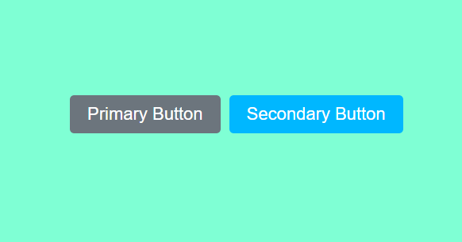

# Purpose of using the var() function in css.

In CSS, the `var()` function is a handy tool that lets designers and developers easily reuse values. These values are stored in what we call CSS variables or custom properties – think of them like special containers for important information.

## How it Works:

1. **Storing Values:**
   We keep our crucial values (like colors or font sizes) in one central place, usually called `:root`. It's like having a master list to stay organized.

2. **Using `var()`:**
   When we want to use one of these stored values in our styles, we use the `var()` function. It's like saying, "Hey, use the value from that special container!"

3. **Why it's Helpful:**
   - **Consistency:** Changing a color or size is easy – we just do it in one place (the master list).
   - **Easy Maintenance:** Updating styles is less confusing because we're not hunting for values everywhere.
   - **Global Changes:** Making changes across the whole website or app is simple because it happens in one central spot.

In simple terms, the `var()` function makes styling more organized and flexible. It's like having a magic wand to quickly adjust styles everywhere without getting lost in a sea of code.

## Example
```css
.blueButton {
    --button-color: #00b7ff;
}
.grayButton {
    --button-color: #6c757d;
}
body {
    width: 100vw;
    height: 100vh;
    display: flex;
    justify-content: center;
    align-items: center;
    background-color: aquamarine;
}
.container {
    display: flex;
    justify-content: center;
    align-items: center;
    gap: 10px;
}

.button {
    padding: 10px 20px;
    color: white;
    background-color: var(--button-color);
    border: none;
    border-radius: 5px;
    -webkit-border-radius: 5px;
    -moz-border-radius: 5px;
    -ms-border-radius: 5px;
    -o-border-radius: 5px;
    cursor: pointer;
    font-size: 20px;
}
```
```html
<!DOCTYPE html>
<html lang="en">
<head>
    <meta charset="UTF-8">
    <meta name="viewport" content="width=device-width, initial-scale=1.0">
    <title>Class 13 || Task 1</title>
    <link rel="stylesheet" href="style.css">
</head>
<body>
    <div class="container">
        <button class="button grayButton" type="submit">
            Primary Button
        </button>
        <button class="button blueButton" type="submit">
            Secondary Button
        </button>
    </div>
</body>
</html>
```
## Image
