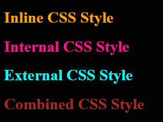
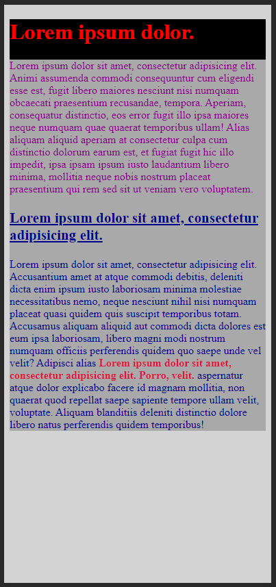
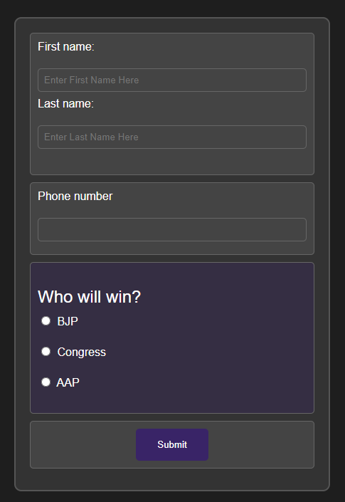

# 23 Sept23 Starting with CSS Assignment

### 1. Create a simple page with some div tags and show different ways to add CSS as well as what happens when you target the same elements with inline, internal, and external CSS. Also, utilize comments in the project where required.

- What happen when we target the same elements with inline, internal and external CSS.
    - Whenever we provide property, it will take priority as following.
        1. Inline CSS
        2. Internal CSS
        3. External CSS file
- **Code**
  ```html
  <!doctype html>
  <html lang="en">
  <head>
      <meta charset="UTF-8">
      <meta name="viewport"
            content="width=device-width, user-scalable=no, initial-scale=1.0, maximum-scale=1.0, minimum-scale=1.0">
      <meta http-equiv="X-UA-Compatible" content="ie=edge">
      <title>CSS L1 Q1</title>
  <!--    THis is an internal CSS style-->
      <style>
          * {
              background-color: #030303;
          }
          .internalCSS {
              color: deeppink;
          }
          .combinedCSS {
              color: #f2f2f2;
          }
      </style>
  <!--    This is an external CSS style-->
      <link rel="stylesheet" href="index.css">
  </head>
  <body>
  <div class="inlineCSS" style="color: orange">
      <h1>Inline CSS Style</h1>
  </div>
  <div class="internalCSS">
      <h1>Internal CSS Style</h1>
  </div>
  <div class="externalCSS">
      <h1>External CSS Style</h1>
  </div>
  <div class="combinedCSS" style="color: brown">
      <h1>Combined CSS Style</h1>
  </div>
  </body>
  </html>
  ```
  ```css
  .externalCSS{
      color: aqua;
  }
  .combinedCSS {
      color: chocolate;
  }
  ```
  

---
### 2. Build an HTML page with multiple paragraphs, each assigned a unique class name. Write CSS rules using class selectors to apply distinct styling to each paragraph. Follow the BEM naming convention and explain how you've named the classes.
- ### BEM (Block, Element, Modifier) Naming Convention

  - BEM is a naming convention for writing clean and modular CSS code. It provides a systematic and structured approach to naming classes, making it easier to understand the purpose of each style rule and promoting a more maintainable codebase.

  - #### Components of BEM:

  - ##### Block
    - A standalone, independent component or module. In the example, `.loremStory` is a block representing a section of content.

  - ##### Element
    - A part of a block that has no standalone meaning and is semantically tied to its block. Elements are denoted by double underscores (`__`). For instance, `.loremStory--title` and `.loremStory--para` are elements inside the `.loremStory` block.

  - ##### Modifier
    - A flag or state that can be applied to a block or an element. Modifiers are denoted by double dashes (`--`). For example, `.loremStory--para--1` and `.loremStory--paraAny--paraTitle` are modifiers that apply specific styles to the `.loremStory--para` block and the title within the paragraph, respectively.

  - #### Why Use BEM?

    - ##### Readability and Maintainability
      - BEM provides a clear and consistent naming structure, making it easier for developers to understand the relationship between HTML and CSS. This improves code readability and makes maintenance more straightforward.

    - ##### Modularity
      - BEM encourages a modular approach to styling. Each block is an independent component, and styles for one block do not interfere with styles for another block. This modularity facilitates code reuse and scalability.

    - ##### Avoiding Specificity Issues
      - BEM helps in avoiding issues related to CSS specificity. Since each block and element has a unique and structured class name, there is less likelihood of unintentional style overrides.

    - ##### Collaboration
      - BEM promotes consistency in naming conventions, which is beneficial for teams working on a project. It establishes a shared vocabulary, making it easier for team members to collaborate and understand each other's code.

    - ##### Scoped Styles
      - BEM provides a way to scope styles to specific components, reducing the chance of styles bleeding into unrelated parts of the application. This helps in creating more isolated and encapsulated styles.

    - ##### Ease of Debugging
      - When styles are organized using BEM, it becomes easier to identify and debug issues in the code. Developers can quickly locate the relevant block or element and make necessary adjustments.

  - In summary, BEM is a naming convention that promotes maintainability, modularity, and collaboration in CSS code. It is particularly useful in large projects with multiple developers, where a systematic and consistent approach to styling is crucial for efficient development and maintenance. 
  - **code**
      ```html
            <!doctype html>
            <html lang="en">
            <head>
                <meta charset="UTF-8">
                <meta name="viewport"
                      content="width=device-width, user-scalable=no, initial-scale=1.0, maximum-scale=1.0, minimum-scale=1.0">
                <meta http-equiv="X-UA-Compatible" content="ie=edge">
                <title>CSS L1 Q2</title>
                <style>
                    body {
                        background: lightgray;
                    }
                    .loremStory {
                        background: black;
                    }
                    .loremStory--title {
                        color: red;
                    }
                    .loremStory--para {
                        background: darkgray;
                    }
                    .loremStory--para--1 {
                        color: darkmagenta;
                    }
                    .loremSotry--para--2 {
                        color: darkblue;
                    }
                    .loremStory--paraAny--paraTitle {
                        text-decoration-line: underline;
                        font-weight: bolder;
                        font-size: large;
                    }
                    .loremStory--paraAny--paraHighlight {
                        color: crimson;
                        font-weight: bolder;
                        font-size: medium;
                    }
                </style>
            </head>
            <body>
            <div class="loremStory">
                <div class="loremStory--title">
                    <h1>Lorem ipsum dolor.</h1>
                </div>
                <div class="loremStory--para">
                    <div class="loremStory--para--1">
                    <p>Lorem ipsum dolor sit amet, consectetur adipisicing elit. Animi assumenda commodi consequuntur cum eligendi esse est, fugit libero maiores nesciunt nisi numquam obcaecati praesentium recusandae, tempora. Aperiam, consequatur distinctio, eos error fugit illo ipsa maiores neque numquam quae quaerat temporibus ullam! Alias aliquam aliquid aperiam at consectetur culpa cum distinctio dolorum earum est, et fugiat fugit hic illo impedit, ipsa ipsam ipsum iusto laudantium libero minima, mollitia neque nobis nostrum placeat praesentium qui rem sed sit ut veniam vero voluptatem.</p>
                    </div>
                    <div class="loremSotry--para--2">
                        <div class="loremStory--paraAny--paraTitle">
                            <h3>Lorem ipsum dolor sit amet, consectetur adipisicing elit.</h3>
                        </div>
                        <p>Lorem ipsum dolor sit amet, consectetur adipisicing elit. Accusantium amet at atque commodi debitis, deleniti dicta enim ipsum iusto laboriosam minima molestiae necessitatibus nemo, neque nesciunt nihil nisi numquam placeat quasi quidem quis suscipit temporibus totam. Accusamus aliquam aliquid aut commodi dicta dolores est eum ipsa laboriosam, libero magni modi nostrum numquam officiis perferendis quidem quo saepe unde vel velit? Adipisci alias <span class="loremStory--paraAny--paraHighlight">Lorem ipsum dolor sit amet, consectetur adipisicing elit. Porro, velit.</span> aspernatur atque dolor explicabo facere id magnam mollitia, non quaerat quod repellat saepe sapiente tempore ullam velit, voluptate. Aliquam blanditiis deleniti distinctio dolore libero natus perferendis quidem temporibus!</p>
                    </div>
                </div>
            </div>
            </body>
            </html>
        ```
   - 

---
### 3. Develop an HTML form with various input elements. Use CSS to style the form, including setting background colors for input fields. Create a custom color palette for the form elements, and demonstrate how to apply opacity to one of the form sections.

- Html code

    ``` html
    <!doctype html>
    <html lang="en">
    <head>
        <meta charset="UTF-8">
        <meta name="viewport"
            content="width=device-width, user-scalable=no, initial-scale=1.0, maximum-scale=1.0, minimum-scale=1.0">
        <meta http-equiv="X-UA-Compatible" content="ie=edge">
        <title>CSS L1 Q3</title>
        <link rel="stylesheet" href="index.css">
    </head>
    <body>
    <div class="form">
        <form action="#" method="post">
            <div class="form--NameDetail">
                <label for="fname">First name:</label><br>
                <input type="text" id="fname" name="fname" placeholder="Enter First Name Here" required><br>
                <label for="lname">Last name:</label><br>
                <input type="text" id="lname" name="lname" placeholder="Enter Last Name Here" required><br><br>
            </div>
            <div class="form--contactDetail">
                <label for="phoneNumber">Phone number</label><br>
                <input type="tel" id="phoneNumber" name="phoneNumber" pattern="[0-9]*" title="Please enter only numbers" required>
            </div>
            <div class="form--question" style="background-color: #39246750">
                <p class="form--question--title"> Who will win? </p>
                <label>
                    <input type="radio" name="electionWinner" value="BJP">
                    BJP
                </label><br>

                <label>
                    <input type="radio" name="electionWinner" value="Congress">
                    Congress
                </label><br>

                <label>
                    <input type="radio" name="electionWinner" value="AAP">
                    AAP
                </label><br>
            </div>
            <div class="submitButton">
                <button type="submit">Submit</button><br>
            </div>
        </form>
    </div>

    </body>
    </html>
    ```
- Css Code
    ```css
    body {
        background-color: #1e1e1e;
        color: #fff;
        font-family: Arial, sans-serif;
        margin: 0;
        display: flex;
        align-items: center;
        justify-content: center;
        height: 100vh;
    }

    .form {
        width: 400px;
        background-color: #333;
        padding: 20px;
        border: 2px solid #555;
        border-radius: 10px;
    }

    .form div {
        border: 1px solid #666;
        padding: 10px;
        margin-bottom: 10px;
        border-radius: 5px;
        background-color: #444;
    }

    .form label {
        display: block;
        margin-bottom: 3px; /* Reduced the gap between label and input */
    }

    .form input[type="text"],
    .form input[type="tel"] {
        width: 100%;
        padding: 8px;
        margin-bottom: 8px; /* Reduced the gap between title and input field */
        box-sizing: border-box;
        border: 1px solid #666;
        border-radius: 5px;
        background-color: #444;
        color: #fff;
    }


    .form--question--title {
        font-size: 24px;
        margin-bottom: 10px;
        color: #fff;
    }

    .form--question label {
        display: block;
        margin-bottom: 5px;
        font-size: 16px;
    }

    .form--question input[type="radio"] {
        margin-right: 5px;
    }

    .submitButton {
        text-align: center;
    }

    .submitButton button {
        padding: 15px 30px;
        background-color: #392467;
        color: #fff;
        border: none;
        border-radius: 5px;
        cursor: pointer;
    }

    .submitButton button:hover {
        background-color: #5D3587;
    }
    ```
- Image
- 
---