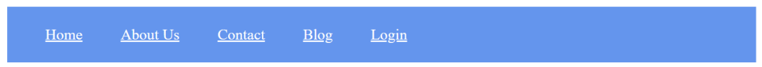
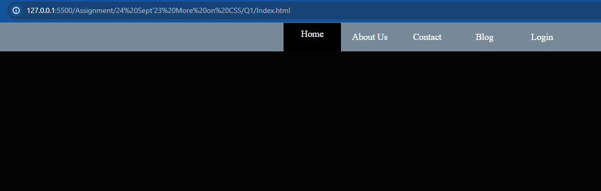
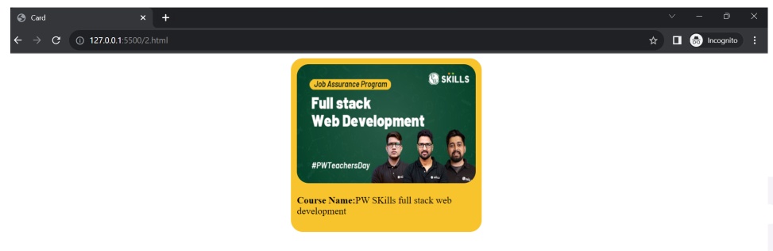
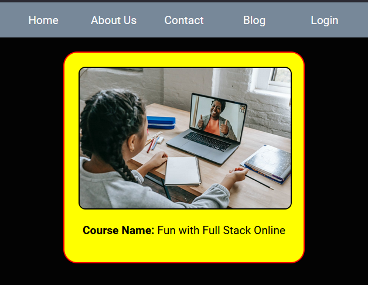
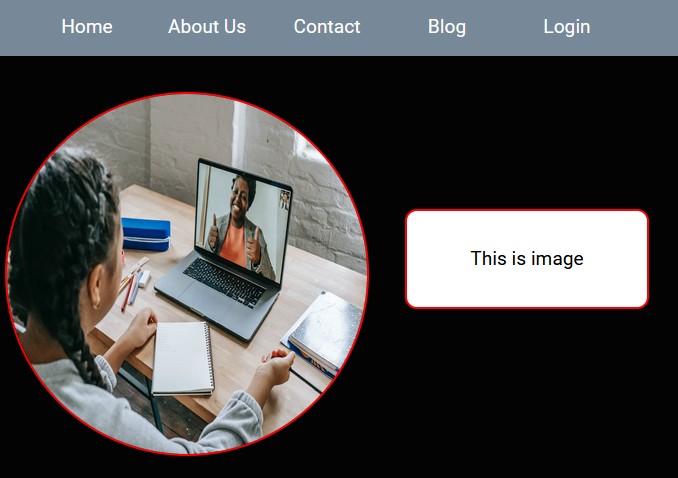
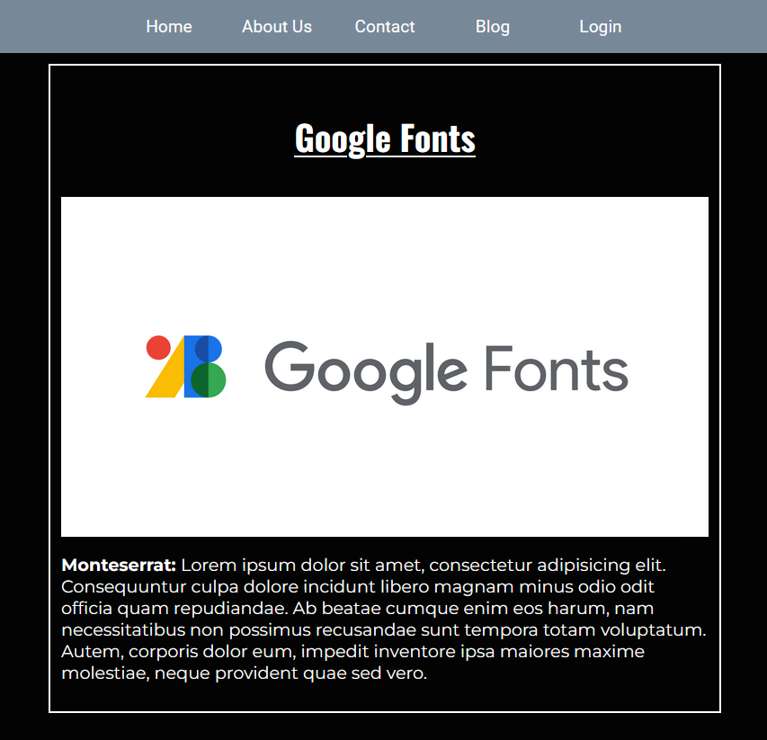
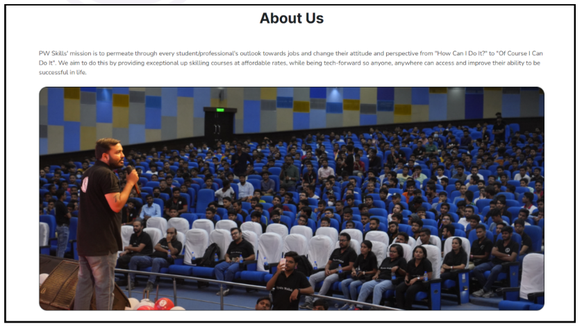
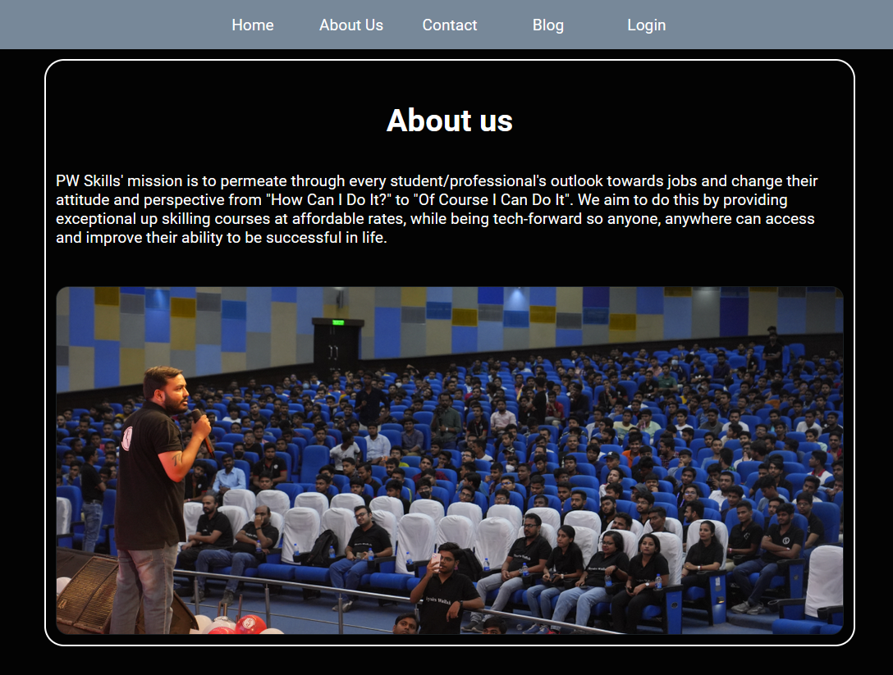
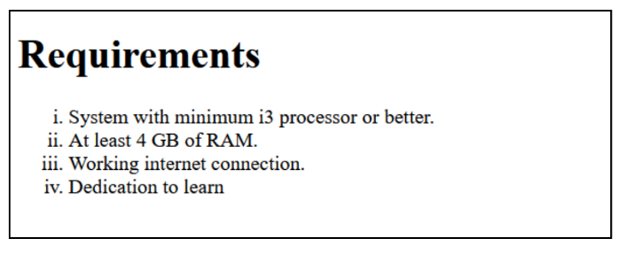
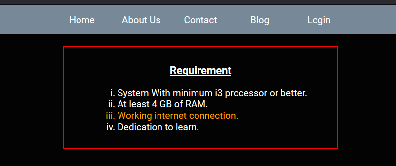

# 24 Sept'23 More on CSS
---
###  Q1. Create a navigation bar similar to the below-mentioned image. The navigation bar must contain 5 navigation links that are properly placed within the navigation bar using the CSS box model. The navigation items must change their text color on hover.

- HTML
  ```html
  <!doctype html>
    <html lang="en">

    <head>
        <meta charset="UTF-8">
        <meta content="width=device-width, user-scalable=no, initial-scale=1.0, maximum-scale=1.0, minimum-scale=1.0"
            name="viewport">
        <meta content="ie=edge" http-equiv="X-UA-Compatible">
        <title>Css L2 Q1 </title>
        <link href="style.css" rel="stylesheet">
    </head>

    <body>
        <nav>
            <div class="navbar" id="navbarDiv">
                <ul>
                    <li>Home</li>
                    <li>About Us</li>
                    <li>Contact</li>
                    <li>Blog</li>
                    <li>Login</li>
                </ul>
            </div>
        </nav>

    </body>

    </html>
  ```
- CSS
    ```css
    body {
    background-color: #030303;
    margin: 0;
    }

    #navbarDiv {
        background-color: lightslategray;
        height: 50px;
    }

    #navbarDiv ul {
        display: flex;
        justify-content: center;
        align-items: center;
        list-style-type: none;
        overflow: hidden;
        text-align: center;
        margin: 0;
        padding: 0;
    }
    #navbarDiv ul li {
        display: flex;
        justify-content: center;
        align-items: center;
        height: 30px;
        width: 100px;
        color: white;
        padding-top: 10px;
        padding-bottom: 10px;
    }

    #navbarDiv ul li:hover {
        background-color: black;
        cursor: pointer;
        align-items: start;
    }
    ```
- Image


---

###  Q2. Create a div centered with an image and paragraph similar to the image mentioned below.

- HTML
  ```html
    <!doctype html>
    <html lang="en">

    <head>
        <meta charset="UTF-8">
        <meta content="width=device-width, user-scalable=no, initial-scale=1.0, maximum-scale=1.0, minimum-scale=1.0"
            name="viewport">
        <meta content="ie=edge" http-equiv="X-UA-Compatible">
        <title>Css L2 Q2 </title>
        <link href="style.css" rel="stylesheet">
        <link rel="preconnect" href="https://fonts.googleapis.com">
        <link rel="preconnect" href="https://fonts.gstatic.com" crossorigin>
        <link
            href="https://fonts.googleapis.com/css2?family=Roboto:ital,wght@0,100;0,300;0,400;0,500;0,700;0,900;1,100;1,300;1,400;1,500;1,700;1,900&display=swap" rel="stylesheet">
    </head>

    <body>
        <nav>
            <div class="navbar" id="navbarDiv">
                <ul>
                    <li>Home</li>
                    <li>About Us</li>
                    <li>Contact</li>
                    <li>Blog</li>
                    <li>Login</li>
                </ul>
            </div>
        </nav>
        <div class="poster--container">
        <div class="poster">
            <div class="poster--image">
                
            </div>
            <div class="poster--text">
                <p><span class="poster--text--title">Course Name:</span>
                <span class="poster--text--content"> Fun with Full Stack Online
                </span>
                </p>
            </div>
        </div>
        </div>
    </body>

    </html>
  ```
- CSS
    ```css
    body {
    background-color: #030303;
    margin: 0;
    font-family: 'Roboto', sans-serif;
    }

    #navbarDiv {
        background-color: lightslategray;
        height: 50px;
    }

    #navbarDiv ul {
        display: flex;
        justify-content: center;
        align-items: center;
        list-style-type: none;
        overflow: hidden;
        text-align: center;
        margin: 0;
        padding: 0;
    }
    #navbarDiv ul li {
        display: flex;
        justify-content: center;
        align-items: center;
        height: 30px;
        width: 100px;
        color: white;
        padding-top: 10px;
        padding-bottom: 10px;
    }

    #navbarDiv ul li:hover {
        background-color: black;
        cursor: pointer;
        align-items: start;
    }

    .poster--container {
        display: flex;
        justify-content: center;
        align-items: center;
    }

    .poster {
        display: flex;
        justify-content: center;
        align-items: center;
        flex-direction: column;
        background-color: yellow;
        padding: 20px;
        margin-top: 20px;
        border-radius: 20px;
        width: 300px;
        height: auto;
        border: 2px solid red;
    }

    .poster .poster--image img {
        width: 100%;
        border-radius: 10px;
        height: auto;
        border: 2px solid black;
    }

    .poster .poster--text {
        padding: 0;
        margin: 0;
    }

    .poster .poster--text .poster--text--title {
        font-weight: bold;
    }
    ```
- Image


---

###  Q3. Create a navigation bar similar to question 1. For each navigation item, use a different border style
- HTML
  ```html
    <!doctype html>
    <!doctype html>
    <html lang="en">

    <head>
        <meta charset="UTF-8">
        <meta content="width=device-width, user-scalable=no, initial-scale=1.0, maximum-scale=1.0, minimum-scale=1.0"
            name="viewport">
        <meta content="ie=edge" http-equiv="X-UA-Compatible">
        <title>Css L2 Q3 </title>
        <link href="style.css" rel="stylesheet">
        <link rel="preconnect" href="https://fonts.googleapis.com">
        <link rel="preconnect" href="https://fonts.gstatic.com" crossorigin>
        <link
            href="https://fonts.googleapis.com/css2?family=Roboto:ital,wght@0,100;0,300;0,400;0,500;0,700;0,900;1,100;1,300;1,400;1,500;1,700;1,900&display=swap"
            rel="stylesheet">
    </head>

    <body>
        <nav>
            <div class="navbar" id="navbarDiv">
                <ul>
                    <li id="li1">Home</li>
                    <li id="li2">About Us</li>
                    <li id="li3">Contact</li>
                    <li id="li4">Blog</li>
                    <li id="li5">Login</li>
                </ul>
            </div>
        </nav>
        <div class="poster--container">
        <div class="poster">
            <div class="poster--image">
                
            </div>
            <div class="poster--text">
                <p><span class="poster--text--title">Course Name:</span>
                <span class="poster--text--content"> Fun with Full Stack Online
                </span>
                </p>
            </div>
        </div>
        </div>
    </body>

    </html>
  ```
- CSS
    ```css
    body {
        background-color: #030303;
        margin: 0;
        font-family: 'Roboto', sans-serif;
    }

    #navbarDiv {
        background-color: lightslategray;
        height: 50px;
    }

    #navbarDiv ul {
        display: flex;
        justify-content: center;
        align-items: center;
        list-style-type: none;
        overflow: hidden;
        text-align: center;
        margin: 0;
        padding: 0;
    }
    #navbarDiv ul li {
        display: flex;
        justify-content: center;
        align-items: center;
        height: 30px;
        width: 100px;
        color: white;
        padding-top: 10px;
        padding-bottom: 10px;
    }

    #navbarDiv ul li:hover {
        background-color: black;
        cursor: pointer;
        align-items: start;
    }

    #li1 {
        border: 2px solid red;
    }
    #li2 {
        border: 2px dotted orange;
    }
    #li3 {
        border: 2px dashed pink;
    }
    #li4 {
        border: 2px double greenyellow;
    }
    #li5 {
        border: 2px orange;
        border-style: dotted dashed solid double;
    }

    .poster--container {
        display: flex;
        justify-content: center;
        align-items: center;
    }

    .poster {
        display: flex;
        justify-content: center;
        align-items: center;
        flex-direction: column;
        background-color: yellow;
        padding: 20px;
        margin-top: 20px;
        border-radius: 20px;
        width: 300px;
        height: auto;
        border: 2px solid red;
    }

    .poster .poster--image img {
        width: 100%;
        border-radius: 10px;
        height: auto;
        border: 2px solid black;
    }

    .poster .poster--text {
        padding: 0;
        margin: 0;
    }

    .poster .poster--text .poster--text--title {
        font-weight: bold;
    }


    ```
- Image


---

###  Q4. Create a simple webpage with an image and make the image circular using border-radius
- HTML
  ```html
    <!doctype html>
    <html lang="en">

    <head>
        <meta charset="UTF-8">
        <meta content="width=device-width, user-scalable=no, initial-scale=1.0, maximum-scale=1.0, minimum-scale=1.0"
            name="viewport">
        <meta content="ie=edge" http-equiv="X-UA-Compatible">
        <title>Css L2 Q4 </title>
        <link href="style.css" rel="stylesheet">
        <link rel="preconnect" href="https://fonts.googleapis.com">
        <link rel="preconnect" href="https://fonts.gstatic.com" crossorigin>
        <link
            href="https://fonts.googleapis.com/css2?family=Roboto:ital,wght@0,100;0,300;0,400;0,500;0,700;0,900;1,100;1,300;1,400;1,500;1,700;1,900&display=swap"
            rel="stylesheet">
    </head>

    <body>
        <nav>
            <div class="navbar" id="navbarDiv">
                <ul>
                    <li>Home</li>
                    <li>About Us</li>
                    <li>Contact</li>
                    <li>Blog</li>
                    <li>Login</li>
                </ul>
            </div>
        </nav>

        <div class="poster">

            <div class="poster--image">
                
            </div>
            <div class="poster--text">
                <p>This is image</p>
            </div>
        </div>

    </body>

    </html>
  ```
- CSS
    ```css
    body {
    background-color: #030303;
    margin: 0;
    font-family: 'Roboto', sans-serif;
    }

    #navbarDiv {
        background-color: lightslategray;
        height: 50px;
    }

    #navbarDiv ul {
        display: flex;
        justify-content: center;
        align-items: center;
        list-style-type: none;
        overflow: hidden;
        text-align: center;
        margin: 0;
        padding: 0;
    }
    #navbarDiv ul li {
        display: flex;
        justify-content: center;
        align-items: center;
        height: 30px;
        width: 100px;
        color: white;
        padding-top: 10px;
        padding-bottom: 10px;
    }

    #navbarDiv ul li:hover {
        background-color: black;
        cursor: pointer;
        align-items: start;
    }

    .poster {
        display: flex;
        justify-content: center;
        align-items: center;
    }

    .poster--image img {
        width: 300px;
        height: 300px;
        border-radius: 50%;
        margin-top: 30px;
        border: 2px solid red;
    }

    .poster--text {
        width: 200px;
        height: 80px;
        border: 2px solid red;
        background-color: white;
        border-radius: 10px;
        margin-left: 30px;
        text-align: center;
        display: flex;
        justify-content: center;
        align-items: center;
    }
    ```
- Image


---

###  Q5. Create a simple blog website about Google fonts. The webpage must have the heading with “Oswald” font align center to the page, below the heading have an image of Google fonts and a paragraph about Google
fonts in font “Montserrat” paragraph font style should be“montserrat” font
- HTML
    ```html
    <!doctype html>
    <html lang="en">

    <head>
        <meta charset="UTF-8">
        <meta content="width=device-width, user-scalable=no, initial-scale=1.0, maximum-scale=1.0, minimum-scale=1.0"
            name="viewport">
        <meta content="ie=edge" http-equiv="X-UA-Compatible">
        <title>Css L2 Q5 </title>
        <link href="style.css" rel="stylesheet">
        <link rel="preconnect" href="https://fonts.googleapis.com">
        <link rel="preconnect" href="https://fonts.gstatic.com" crossorigin>
        <link href="https://fonts.googleapis.com/css2?family=Montserrat:ital,wght@0,100;0,200;0,300;0,400;0,500;0,600;0,700;0,800;0,900;1,100;1,200;1,300;1,400;1,500;1,600;1,700;1,800;1,900&family=Oswald:wght@200;300;400;500;600;700&family=Roboto:ital,wght@0,100;0,300;0,400;0,500;0,700;0,900;1,100;1,300;1,400;1,500;1,700;1,900&display=swap" rel="stylesheet">
    </head>

    <body>
    <nav>
        <div class="navbar" id="navbarDiv">
            <ul>
                <li>Home</li>
                <li>About Us</li>
                <li>Contact</li>
                <li>Blog</li>
                <li>Login</li>
            </ul>
        </div>
    </nav>

    <div class="content">
        <div class="content--container">
            <div class="content--title">
                <p>Google Fonts</p>
            </div>
            <div class="content--image">
                
            </div>
            <div class="content--text">
                <p><span>Monteserrat: </span>Lorem ipsum dolor sit amet, consectetur adipisicing elit. Consequuntur culpa dolore incidunt libero magnam minus odio odit officia quam repudiandae. Ab beatae cumque enim eos harum, nam necessitatibus non possimus recusandae sunt tempora totam voluptatum. Autem, corporis dolor eum, impedit inventore ipsa maiores maxime molestiae, neque provident quae sed vero.</p>
            </div>
        </div>
    </div>

    </body>

    </html>
  ```
- CSS
    ```css
    body {
        background-color: #030303;
        margin: 0;
        font-family: 'Roboto', sans-serif;
    }

    #navbarDiv {
        background-color: lightslategray;
        height: 50px;
    }

    #navbarDiv ul {
        display: flex;
        justify-content: center;
        align-items: center;
        list-style-type: none;
        overflow: hidden;
        text-align: center;
        margin: 0;
        padding: 0;
    }
    #navbarDiv ul li {
        display: flex;
        justify-content: center;
        align-items: center;
        height: 30px;
        width: 100px;
        color: white;
        padding-top: 10px;
        padding-bottom: 10px;
    }

    #navbarDiv ul li:hover {
        background-color: black;
        cursor: pointer;
        align-items: start;
    }
    .content{
        margin-top: 10px;
        display: flex;
        justify-content: center;
        align-items: center;
    }
    .content .content--container {
        width: 600px;
        height: auto;
        overflow: hidden;
        margin: 0;
        padding: 10px;
        border: 2px solid white;
    }
    .content .content--container .content--image img {
        width: 100%;
        height: auto;
        display: block;
    }

    .content .content--container .content--text p {
        color: white;
        font-family: 'Montserrat', sans-serif;
    }

    .content .content--container .content--title p {
        color: white;
        font-family: 'Oswald', sans-serif;
        text-align: center;
        font-size: xx-large;
        font-weight: bold;
        text-decoration: underline;
    }
    .content .content--container .content--text span {
        font-weight: bold;
    }

    ```
- Image


---

###  Q6. Create a simple website as mentioned in the below image. You can get the assets by visiting https://pwskills.com/about-us.

- HTML
    ```html
    <!doctype html>
    <html lang="en">

    <head>
        <meta charset="UTF-8">
        <meta content="width=device-width, user-scalable=no, initial-scale=1.0, maximum-scale=1.0, minimum-scale=1.0"
            name="viewport">
        <meta content="ie=edge" http-equiv="X-UA-Compatible">
        <title>Css L2 Q6 </title>
        <link href="style.css" rel="stylesheet">
        <link rel="preconnect" href="https://fonts.googleapis.com">
        <link rel="preconnect" href="https://fonts.gstatic.com" crossorigin>
        <link href="https://fonts.googleapis.com/css2?family=Montserrat:ital,wght@0,100;0,200;0,300;0,400;0,500;0,600;0,700;0,800;0,900;1,100;1,200;1,300;1,400;1,500;1,600;1,700;1,800;1,900&family=Oswald:wght@200;300;400;500;600;700&family=Roboto:ital,wght@0,100;0,300;0,400;0,500;0,700;0,900;1,100;1,300;1,400;1,500;1,700;1,900&display=swap" rel="stylesheet">
    </head>

    <body>
    <nav>
        <div class="navbar" id="navbarDiv">
            <ul>
                <li>Home</li>
                <li>About Us</li>
                <li>Contact</li>
                <li>Blog</li>
                <li>Login</li>
            </ul>
        </div>
    </nav>

    <div class="content">
        <div class="content--container">
            <div class="content--title">
                <p>About us</p>
            </div>
            <div class="content--text">
            <p>PW Skills' mission is to permeate through every student/professional's outlook towards jobs and change their attitude and perspective from "How Can I Do It?" to "Of Course I Can Do It". We aim to do this by providing exceptional up skilling courses at affordable rates, while being tech-forward so anyone, anywhere can access and improve their ability to be successful in life.</p>
            </div>
            <div class="content--image">
                
            </div>
        </div>
    </div>

    </body>

    </html>
  ```
- CSS
    ```css
    body {
        background-color: #030303;
        margin: 0;
        font-family: 'Roboto', sans-serif;
    }

    #navbarDiv {
        background-color: lightslategray;
        height: 50px;
    }

    #navbarDiv ul {
        display: flex;
        justify-content: center;
        align-items: center;
        list-style-type: none;
        overflow: hidden;
        text-align: center;
        margin: 0;
        padding: 0;
    }
    #navbarDiv ul li {
        display: flex;
        justify-content: center;
        align-items: center;
        height: 30px;
        width: 100px;
        color: white;
        padding-top: 10px;
        padding-bottom: 10px;
    }

    #navbarDiv ul li:hover {
        background-color: black;
        cursor: pointer;
        align-items: start;
    }
    .content{
        margin-top: 10px;
        display: flex;
        justify-content: center;
        align-items: center;
    }
    .content .content--container {
        width: 800px;
        height: auto;
        overflow: hidden;
        margin: 0;
        padding: 10px;
        border: 2px solid white;
        border-radius: 20px;
    }
    .content .content--container .content--image img {
        width: 100%;
        height: auto;
        display: block;
        margin-top: 40px;
    }

    .content .content--container .content--text p {
        color: white;
    }

    .content .content--container .content--title p {
        color: white;
        text-align: center;
        font-size: xx-large;
        font-weight: bold;
    }
    .content .content--container .content--text span {
        font-weight: bold;
    }

    ```
- Image


###  Q7. Create a simple webpage with a card similar to The card must be semi-transparent as default and on hovering the card must be displayed clearly. Use CSS opacity to achieve this output.

- HTML
    ```html
    <!doctype html>
    <html lang="en">

    <head>
        <meta charset="UTF-8">
        <meta content="width=device-width, user-scalable=no, initial-scale=1.0, maximum-scale=1.0, minimum-scale=1.0"
            name="viewport">
        <meta content="ie=edge" http-equiv="X-UA-Compatible">
        <title>Css L2 Q7 </title>
        <link href="style.css" rel="stylesheet">
        <link rel="preconnect" href="https://fonts.googleapis.com">
        <link rel="preconnect" href="https://fonts.gstatic.com" crossorigin>
        <link
            href="https://fonts.googleapis.com/css2?family=Roboto:ital,wght@0,100;0,300;0,400;0,500;0,700;0,900;1,100;1,300;1,400;1,500;1,700;1,900&display=swap"
            rel="stylesheet">
    </head>

    <body>
        <nav>
            <div class="navbar" id="navbarDiv">
                <ul>
                    <li>Home</li>
                    <li>About Us</li>
                    <li>Contact</li>
                    <li>Blog</li>
                    <li>Login</li>
                </ul>
            </div>
        </nav>
        <div class="poster--container">
        <div class="poster">
            <div class="poster--image">
                
            </div>
            <div class="poster--text">
                <p><span class="poster--text--title">Course Name:</span>
                <span class="poster--text--content"> Fun with Full Stack Online
                </span>
                </p>
            </div>
        </div>
        </div>
    </body>

    </html>
  ```
- CSS
    ```css
    body {
    background-color: #030303;
    margin: 0;
    font-family: 'Roboto', sans-serif;
    }

    #navbarDiv {
        background-color: lightslategray;
        height: 50px;
    }

    #navbarDiv ul {
        display: flex;
        justify-content: center;
        align-items: center;
        list-style-type: none;
        overflow: hidden;
        text-align: center;
        margin: 0;
        padding: 0;
    }
    #navbarDiv ul li {
        display: flex;
        justify-content: center;
        align-items: center;
        height: 30px;
        width: 100px;
        color: white;
        padding-top: 10px;
        padding-bottom: 10px;
    }

    #navbarDiv ul li:hover {
        background-color: black;
        cursor: pointer;
        align-items: start;
    }

    .poster--container {
        display: flex;
        justify-content: center;
        align-items: center;
    }

    .poster {
        display: flex;
        justify-content: center;
        align-items: center;
        flex-direction: column;
        background-color: yellow;
        padding: 20px;
        margin-top: 20px;
        border-radius: 20px;
        width: 300px;
        height: auto;
        border: 2px solid red;
        opacity: 0.2;
    }

    .poster .poster--image img {
        width: 100%;
        border-radius: 10px;
        height: auto;
        border: 2px solid black;
    }

    .poster .poster--text {
        padding: 0;
        margin: 0;
    }

    .poster .poster--text .poster--text--title {
        font-weight: bold;
    }

    .poster:hover {
        opacity: 1;
    }
    ```
- Image


---

### Q8. Create a simple list of items as mentioned in the below image.

- HTML
  ```html
  <!doctype html>
    <html lang="en">

    <head>
        <meta charset="UTF-8">
        <meta content="width=device-width, user-scalable=no, initial-scale=1.0, maximum-scale=1.0, minimum-scale=1.0"
            name="viewport">
        <meta content="ie=edge" http-equiv="X-UA-Compatible">
        <title>Css L2 Q8 </title>
        <link href="style.css" rel="stylesheet">
        <link rel="preconnect" href="https://fonts.googleapis.com">
        <link rel="preconnect" href="https://fonts.gstatic.com" crossorigin>
        <link
            href="https://fonts.googleapis.com/css2?family=Roboto:ital,wght@0,100;0,300;0,400;0,500;0,700;0,900;1,100;1,300;1,400;1,500;1,700;1,900&display=swap"
            rel="stylesheet">
    </head>

    <body>
        <nav>
            <div class="navbar" id="navbarDiv">
                <ul>
                    <li>Home</li>
                    <li>About Us</li>
                    <li>Contact</li>
                    <li>Blog</li>
                    <li>Login</li>
                </ul>
            </div>
        </nav>
    <div class="list">
        <div class="list--container">
            <div class="list--title">
                <p>Requirement</p>
            </div>
            <div class="list--li">
                <ol>
                    <li>System With minimum i3 processor or better.</li>
                    <li>At least 4 GB of RAM.</li>
                    <li>Working internet connection.</li>
                    <li>Dedication to learn.</li>
                </ol>
            </div>
        </div>
    </div>
    </body>

    </html>
  ```
- CSS
    ```css
    body {
        background-color: #030303;
        margin: 0;
        font-family: 'Roboto', sans-serif;
    }

    #navbarDiv {
        background-color: lightslategray;
        height: 50px;
    }

    #navbarDiv ul {
        display: flex;
        justify-content: center;
        align-items: center;
        list-style-type: none;
        overflow: hidden;
        text-align: center;
        margin: 0;
        padding: 0;
    }
    #navbarDiv ul li {
        display: flex;
        justify-content: center;
        align-items: center;
        height: 30px;
        width: 100px;
        color: white;
        padding-top: 10px;
        padding-bottom: 10px;
    }

    #navbarDiv ul li:hover {
        background-color: black;
        cursor: pointer;
        align-items: start;
    }

    .list {
        display: flex;
        justify-content: center;
        align-items: center;
        color: white;
        margin-top: 20px;
    }

    .list .list--container {
        border: 2px solid red;
        padding: 10px 50px;
    }

    .list .list--container .list--title {
        font-size: large;
        text-align: center;
        font-weight: bold;
        text-decoration: underline;
    }

    .list .list--container .list--li ol li {
        list-style: lower-roman;
    }

    .list .list--container .list--li ol li:hover {
        color: orange;
        cursor: pointer;
    }
  ```
- Image
