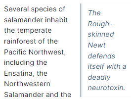
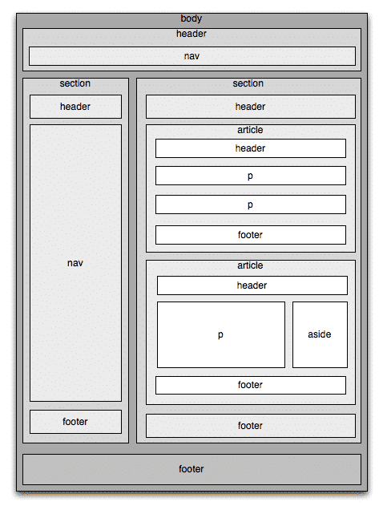

# Modern HTML
---
#### Q1 What are the features of the HTML 5?
##### 1. Semantic Elements:
- `<header>` tags - This tag helps to provide headers in html file for better readability.
- `<footer>` tags - This tag helps to provide footer in html file for better readability.
- `<nav>` tag - This tag is used to provide navigation bar, and menus.
- `<section>`- section tag abel user to provide a broad level section in HTML
- `<article>` tag - The HTML article tag defines a self-contained piece of content in a document, page, application, or site. The content in the article tag should be independent and complete from other content on the page.
- `<aside>` tag - as shown in image, by this tag is provided when we want to provide indirect information.

  
- **Here is an image to summarize all the tags**

  

#### 2. Audio Video Support:

- Audio tag - Audio files can be directly added without additional support for the plugin.
- Video tag - Video files can be directly added without additional support for the plugin.
#### 3. Canvas Elements:
- A blank drawing surface for dynamic graphic and animation is provided for multiple applications.

#### 4. GeoLocation API:

- It helps to share user's location with their permission.
#### 5. Local Storage:

- It Allows websites to store data locally in the user's browser, enabling capabilities and personalized experiences.

#### 6. Form Enhancement:

- Improved form validation, new input types like email, URL, date,placeholder text, and required fields are added in the
  HTML 5.
#### 7. Responsive Image:
- Ensure images adapt to different screen size.
#### 8. Web Workers:

- Run Javascript code in the background without blocking the main threads.
#### 9. Drag and droop API:
- Enable drag-and drop functionality.
#### 10. Websockets:

- Establish persistent, bidirectional communication between browser and server.
#### 11. Microdata:

- Embed structured data into web pages for search engines and other applications.
#### 12. Cross-document Messaging:
- Allow communication between different windows or frames.

---

#### Q2 What are HTML entities? List of five commonly used HTML entities.

HTML entities are special codes used to represent reserved characters and symbols in HTML markup. These entities are used to display characters that have a special meaning in HTML, such as `<` (less than), `>` (greater than), and `&` (ampersand), without causing parsing errors. Here are five commonly used HTML entities:

1. `&lt;` - Represents the less than symbol (`<`).
2. `&gt;` - Represents the greater than symbol (`>`).
3. `&amp;` - Represents the ampersand symbol (`&`).
4. `&quot;` - Represents the double quotation mark (`"`).
5. `&apos;` - Represents the apostrophe (`'`).

These entities are particularly useful when you want to display special characters in your HTML document without interfering with the document's structure and rendering.

---

#### Q3 Defines accessibility in the context of web development. Discuss why it's essential to create an accessible website and how it benefits different user groups.

- **What is accessibility?**
  - accessibility is referring to the practice of designing and developing website and web applications in a way that
    all user groups can use it regardless of age, disability and physical abilities.
- **Why is it important?**
  - As mentioned above, it ensures that all groups of people can access is the biggest factor
  - Apart from that in the USA, there is an _ADA_ (American disability act) which mandates that every user should be
    able to access the website.
  - Moreover, it also enhances the user experience.
  - apart from that, there are many factors like its improve SEO ranking, increase market reach, etc.
- **what are the benefits of different user groups?**
  - **Visual imper** : This group is benefited as this website uses image assist and alternative text so that they can
    use it. apart from that it also have the high contrast design and option to make text bigger so low-vision people
    can also use it.
  - **Hearing imper** : These websites have captions and transcripts for the multimedia files, so they also can interact
    with the websites.
  - **And there are many more benefits of the creating accessible website but above shown are the most prominent
    reasons.**

---

#### Q4 Lists any three ways that help us in improving the accessibility of HTML.

1. **Semantic Markup:**
- Use the right element for the job: Instead of generic `<div>`s, prioritize elements like `<header>`, `<nav>`, `<section>`, `<article>`, and `<aside>` that clearly define the structure and purpose of content. This helps screen readers understand the page layout and makes navigation easier for everyone.

- Structure headings logically: Utilize heading tags (`H1`, `H2`, `H3`) to indicate hierarchy and organize content sections. This allows users to skim and jump to relevant parts easily.

2. **Descriptive Text and Alternatives:**

- Write clear and concise text: Avoid jargon and complex language. Aim for straightforward wording that everyone can understand.

- Add informative alt text to images: Describe the image content accurately, providing context for visually impaired users who rely on screen readers.

- Provide transcripts or captions for audio and video content: This ensures everyone can access the information, regardless of their hearing ability.

3. **Keyboard Navigation and Focus:**

- Ensure all elements are keyboard-accessible: Users who rely on keyboards should be able to navigate and interact with
  all functionalities on the page.

- Clearly indicate focus state: Use styles or visual cues to highlight which element is currently selected, aiding keyboard users in understanding their location and actions.

- Follow logical tab order: Arrange the order in which keyboard focus moves between elements logically, making navigation intuitive and efficient.

---

#### Q5 Creates a web page that highlights the feature of HTML5. Use appropriate semantic tags to structure the content and showcase at least three key feature HTML5 with explanations. 

```html
<!doctype html>
<html lang="en">
<head>
    <meta charset="UTF-8">
    <meta content="width=device-width, user-scalable=no, initial-scale=1.0, maximum-scale=1.0, minimum-scale=1.0"
          name="viewport">
    <meta content="ie=edge" http-equiv="X-UA-Compatible">
    <title>Assignment Q5</title>
    <style>
        body {
            font-family: Arial, sans-serif;
        }

        header, nav, aside, main, section, footer {
            border: 1px solid #ccc;
            margin: 10px;
            padding: 10px;
        }

        h1, h2 {
            color: #333;
        }

        nav p, aside p, main p, article p, section p, footer h2 {
            margin: 0;
        }

        article {
            margin-top: 15px;
        }

        figure {
            margin: 10px 0;
        }

        img {
            max-width: 100%;
            height: auto;
        }

        figcaption {
            font-style: italic;
            font-size: 0.8em;
            color: #666;
        }
    </style>
</head>
<body>
<header>
    <h1>This is a header</h1>
</header>
<nav>
    <p>is navigation bar</p>
</nav>
<aside>
    <p>This is aside content</p>
</aside>
<main>
    <p>This is a main content</p>
    <article>
        <p>
            This is an article tag
        </p>
        <figure>
            
            <figcaption>Fig.1 - Trulli, Puglia, Italy.</figcaption>
        </figure>
    </article>
</main>
<section>
    <p>
        This is a section.
    </p>
</section>
<footer>
    <h2>This is a footer</h2>
</footer>

</body>
</html>

```

---

#### Q6 Creates a simple web page which has a table. The table must have 2 columns HTML and HTML5. The table should include a minimum of three rows describing the differences between HTML and HTML5. 

```html
<!DOCTYPE html>
<html lang="en">
<head>
    <meta charset="UTF-8">
    <meta name="viewport" content="width=device-width, initial-scale=1.0">
    <title>HTML vs HTML5 Comparison</title>
    <style>
        body {
            font-family: Arial, sans-serif;
            margin: 20px;
        }

        table {
            width: 100%;
            border-collapse: collapse;
            margin-top: 20px;
        }

        th, td {
            border: 1px solid #ccc;
            padding: 10px;
            text-align: left;
        }

        th {
            background-color: #f2f2f2;
        }
    </style>
</head>
<body>

<h1>HTML vs HTML5 Comparison</h1>

<table>
    <tr>
        <th>HTML</th>
        <th>HTML5</th>
    </tr>
    <tr>
        <td>Requires plugins like Flash for multimedia</td>
        <td>Eliminates the need for third-party plugins for multimedia</td>
    </tr>
    <tr>
        <td>Does not have a semantic structure</td>
        <td>Introduces semantic tags such as <code>&lt;header&gt;</code>, <code>&lt;footer&gt;</code>, etc.</td>
    </tr>
    <tr>
        <td>Does not have a native drawing API</td>
        <td>Introduces the <code>&lt;canvas&gt;</code> element for dynamic drawing</td>
    </tr>
    <tr>
        <td>Form validation relies on JavaScript</td>
        <td>Introduces new form input types and attributes for better validation</td>
    </tr>
</table>

</body>
</html>
```