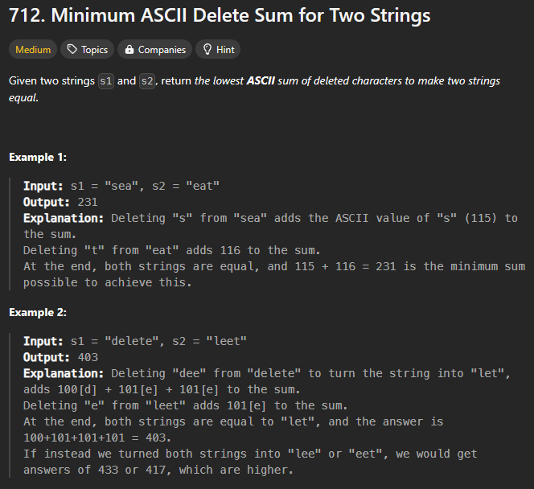

# 1155. Number of Dice Rolls With Target Sum

**Difficulty:** Medium

**Topics:** Dynamic Programming

**Companies:** 

**Hint:**

## Problem

You have `n` dice, and each die has `k` faces numbered from 1 to `k`.

Given three integers `n`, `k`, and `target`, return the number of possible ways (out of the `k^n` total ways) to roll the dice so the sum of the face-up numbers equals `target`. Since the answer may be too large, return it modulo 10^9 + 7.

## Examples

**Example 1:**

Input: n = 1, k = 6, target = 3
Output: 1
Explanation: There is only one way to get a sum of 3 when rolling a single 6-sided die: roll a 3.

**Example 2:**

Input: n = 2, k = 6, target = 7
Output: 6
Explanation: There are 6 ways to get a sum of 7 when rolling two 6-sided dice:
1+6, 2+5, 3+4, 4+3, 5+2, 6+1.

**Example 3:**

Input: n = 30, k = 30, target = 500
Output: 222616187
Explanation: The answer must be returned modulo 10^9 + 7.

## Constraints

* 1 <= n, k <= 30
* 1 <= target <= 1000

---

#712. Minimum ASCII Delete Sum for Two Strings
# Lowest ASCII Sum of Deleted Characters

Given two strings s1 and s2, return the lowest ASCII sum of deleted characters to make two strings equal.

## Example 1:

**Input:** 
s1 = "sea", s2 = "eat"

**Output:** 
231

**Explanation:** 
Deleting "s" from "sea" adds the ASCII value of "s" (115) to the sum.
Deleting "t" from "eat" adds 116 to the sum.
At the end, both strings are equal, and 115 + 116 = 231 is the minimum sum possible to achieve this.

## Example 2:

**Input:** 
s1 = "delete", s2 = "leet"

**Output:** 
403

**Explanation:** 
Deleting "dee" from "delete" to turn the string into "let", adds 100[d] + 101[e] + 101[e] to the sum.
Deleting "e" from "leet" adds 101[e] to the sum.
At the end, both strings are equal to "let", and the answer is 100 + 101 + 101 + 101 = 403.
If instead we turned both strings into "lee" or "eet", we would get answers of 433 or 417, which are higher.

